# Module 7 - Profiling

---

## Performance Testing dengan JMeter

### Endpoint `/all-student`

**Test Plan:** `test_plan_1.jmx` | **Threads:** 10 | **Ramp-up:** 1s

#### Hasil GUI (sebelum optimasi):

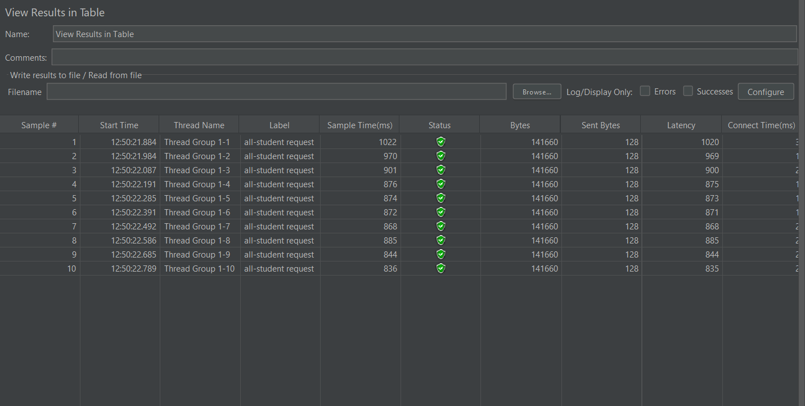

#### Hasil GUI (setelah optimasi):

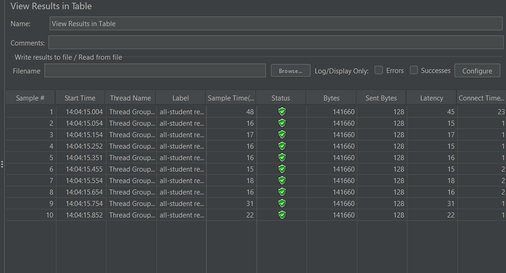

#### Hasil Command Line (sebelum optimasi):

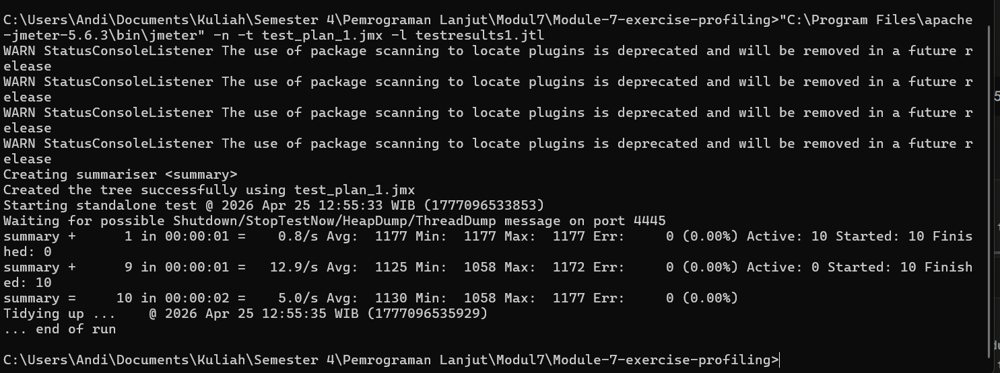

#### Hasil Command Line (setelah optimasi):

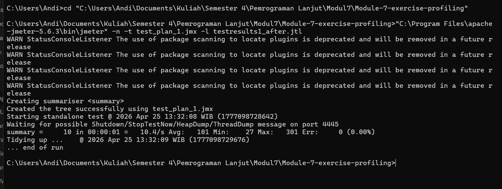

**Perbandingan:**
| Metric | Sebelum | Sesudah | Improvement |
|--------|---------|---------|-------------|
| Avg Sample Time (ms) | 1130 | 101 | ~91% ✅ |
| Min Sample Time (ms) | 1058 | 27 | ~97% ✅ |
| Max Sample Time (ms) | 1177 | 301 | ~74% ✅ |

---

### Endpoint `/all-student-name`

**Test Plan:** `test_plan_2.jmx` | **Threads:** 10 | **Ramp-up:** 1s

#### Hasil GUI (sebelum optimasi):

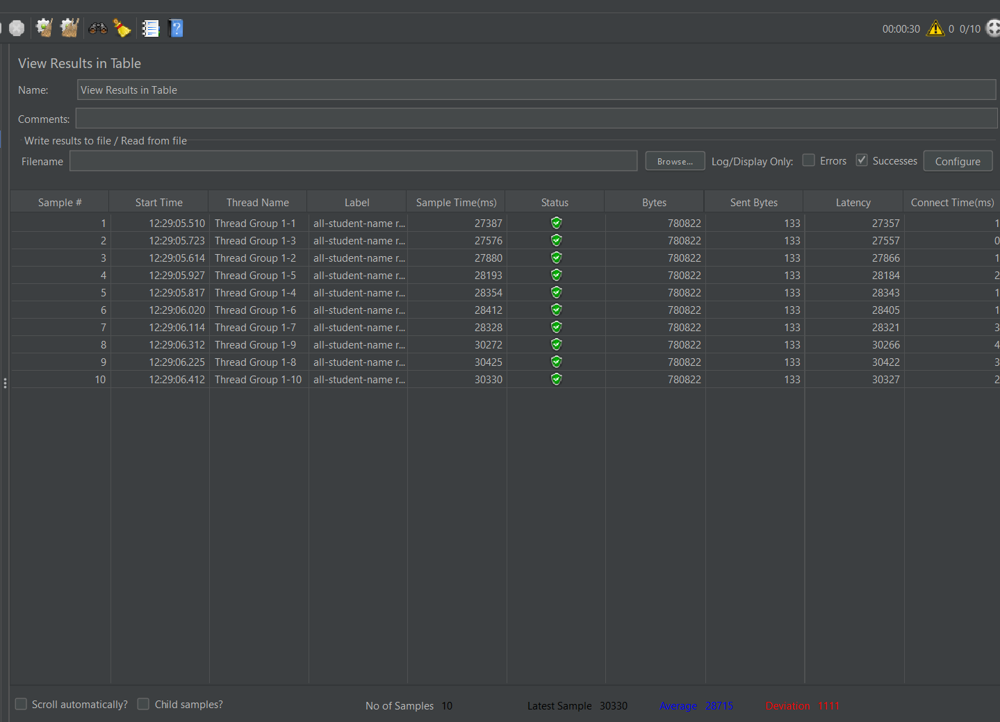

#### Hasil GUI (setelah optimasi):

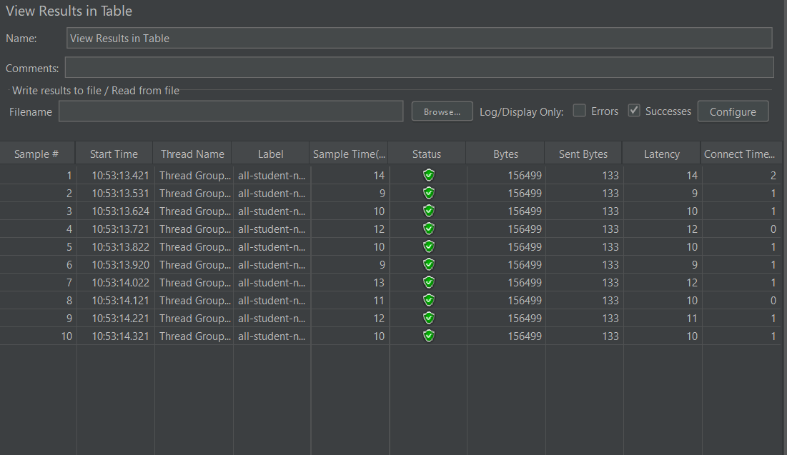

#### Hasil Command Line (sebelum optimasi):

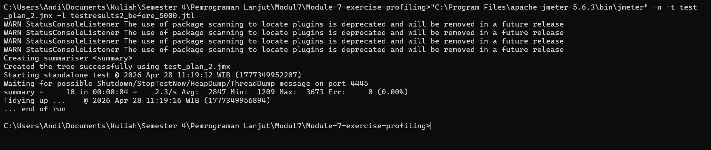

#### Hasil Command Line (setelah optimasi):

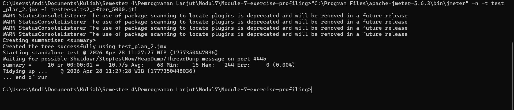

---

### Endpoint `/highest-gpa`

**Test Plan:** `test_plan_3.jmx` | **Threads:** 10 | **Ramp-up:** 1s

#### Hasil GUI (sebelum optimasi):

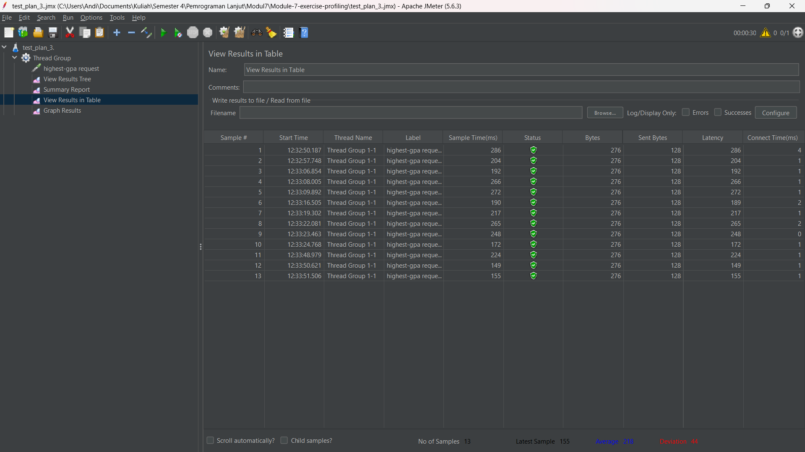

#### Hasil GUI (setelah optimasi):

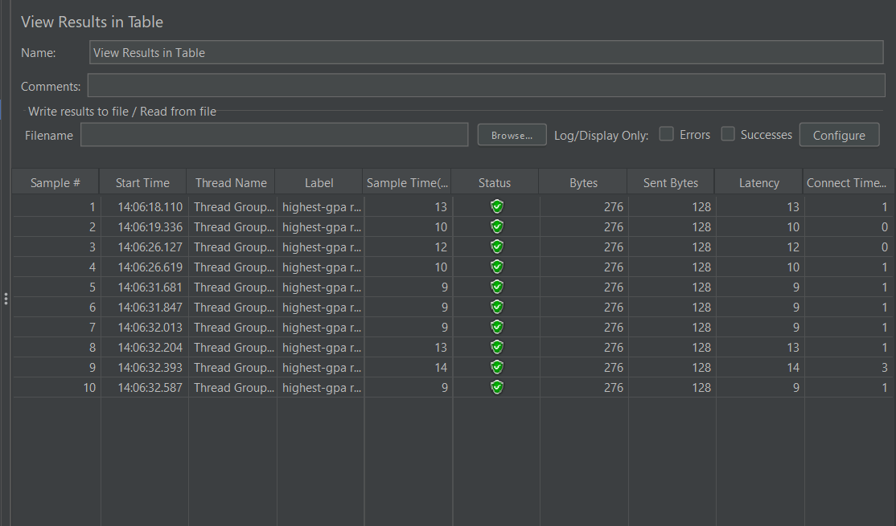

#### Hasil Command Line (sebelum optimasi):

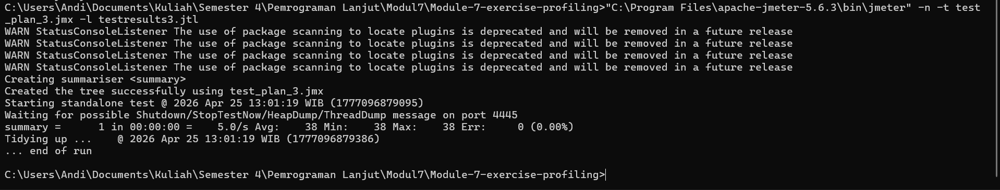

#### Hasil Command Line (setelah optimasi):

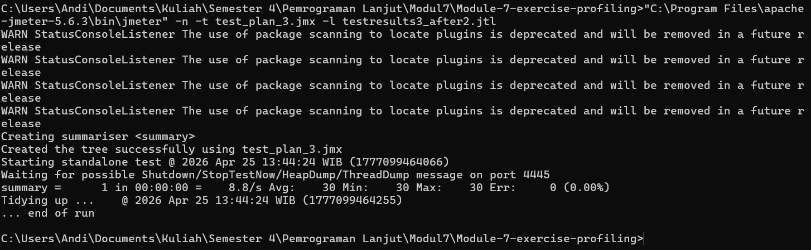

**Perbandingan:**
| Metric | Sebelum | Sesudah | Improvement |
|--------|---------|---------|-------------|
| Avg Sample Time (ms) | 38 | 30 | ~21% ✅ |
| Min Sample Time (ms) | 38 | 30 | ~21% ✅ |
| Max Sample Time (ms) | 38 | 30 | ~21% ✅ |

---

## Profiling dengan IntelliJ Profiler

### Endpoint `/all-student`

Berdasarkan hasil profiling menggunakan IntelliJ Profiler, method yang paling banyak mengonsumsi resource adalah **`getAllStudentsWithCourses`**. Method ini mengalami masalah **N+1 Query Problem** — untuk setiap student dilakukan satu query tambahan ke tabel `student_courses`, sehingga total query yang dijalankan = jumlah student + 1. Dengan 1000 student, terjadi 1001 query ke database.

Solusi: mengganti looping query dengan satu JOIN FETCH query menggunakan `@Query` di `StudentCourseRepository`.

---

### Endpoint `/all-student-name`

Method `joinStudentNames` mengambil seluruh objek Student ke memory lalu melakukan string concatenation menggunakan `+=` di dalam loop. Ini sangat boros memori karena setiap iterasi membuat objek String baru.

Solusi: mengambil hanya kolom nama langsung dari database menggunakan `@Query("SELECT s.name FROM Student s")` dan menggabungkannya dengan `String.join()`.
Endpoint ini sudah sangat cepat sejak awal karena hanya mengambil satu kolom (nama), sehingga improvement tidak terlalu signifikan pada pengukuran JMeter. Namun secara kode, penggunaan memori jauh lebih efisien karena tidak lagi membuat objek String baru di setiap iterasi."
---

### Endpoint `/highest-gpa`

Method `findStudentWithHighestGpa` mengambil seluruh data student ke memory lalu mencari nilai GPA tertinggi secara manual di Java.

Solusi: menggunakan derived query `findFirstByOrderByGpaDesc()` yang langsung mengambil satu record teratas dari database, sehingga tidak perlu memuat semua data ke memory.

---

## Reflection

**1. Apa perbedaan pendekatan performance testing dengan JMeter dan profiling dengan IntelliJ Profiler dalam konteks optimasi performa aplikasi?**

JMeter melakukan performance testing dari sisi **luar** aplikasi — mensimulasikan banyak user yang menghit endpoint secara bersamaan dan mengukur response time serta throughput. Hasilnya berupa metrik seperti sample time dan error rate, namun tidak menjelaskan *mengapa* aplikasi lambat.

IntelliJ Profiler bekerja dari sisi **dalam** aplikasi — merekam eksekusi nyata di level method/fungsi, menampilkan CPU time, heap memory, dan flame graph. Profiler membantu mengidentifikasi *di mana tepatnya* bottleneck terjadi dalam source code, sehingga optimasi bisa dilakukan secara tepat sasaran.

Keduanya bersifat komplementer: JMeter mengukur *seberapa* lambat, IntelliJ Profiler mengungkap *mengapa* lambat.

---

**2. Bagaimana proses profiling membantu mengidentifikasi dan memahami titik lemah dalam aplikasi?**

Profiling memberikan visibilitas langsung ke dalam eksekusi kode. Melalui flame graph, terlihat bahwa method `getAllStudentsWithCourses` mengonsumsi sebagian besar CPU time. Setelah ditelusuri di Method List dan source code, ditemukan pola N+1 Query — setiap iterasi student memicu satu query tambahan ke database. Tanpa profiling, masalah ini sulit terdeteksi hanya dari melihat kode secara manual.

---

**3. Apakah IntelliJ Profiler efektif dalam membantu menganalisis dan mengidentifikasi bottleneck dalam kode aplikasi?**

Ya, IntelliJ Profiler sangat efektif. Flame graph secara visual menunjukkan method mana yang mendominasi CPU time, dan tab Method List memungkinkan perbandingan execution time antar method secara kuantitatif. Fitur comparison view antara dua sesi profiling juga sangat membantu untuk memverifikasi bahwa refactoring yang dilakukan benar-benar meningkatkan performa.

---

**4. Apa tantangan utama yang dihadapi saat melakukan performance testing dan profiling, dan bagaimana mengatasinya?**

- **JVM Warm-up**: Run pertama selalu lebih lambat karena JIT compiler belum optimal. Diatasi dengan me-restart aplikasi beberapa kali sebelum mengambil data pengukuran.
- **Variasi hasil**: Setiap run JMeter bisa memberikan hasil yang sedikit berbeda tergantung kondisi sistem. Diatasi dengan mengambil rata-rata dari beberapa run.
- **Membaca flame graph**: Awalnya membingungkan karena banyak method framework (Spring, Hibernate). Diatasi dengan fokus pada method milik package aplikasi sendiri (`com.advpro.profiling.tutorial`).

---

**5. Apa manfaat utama menggunakan IntelliJ Profiler untuk profiling kode aplikasi?**

- Terintegrasi langsung dengan IDE tanpa perlu tool tambahan
- Flame graph memudahkan identifikasi bottleneck secara visual
- Method List memberikan data CPU time dan execution time yang akurat
- Fitur comparison view memudahkan verifikasi hasil optimasi
- Timeline tab membantu memahami urutan eksekusi dan thread yang aktif

---

**6. Bagaimana jika hasil profiling IntelliJ tidak sepenuhnya konsisten dengan hasil performance testing JMeter?**

Ketidakkonsistenan bisa terjadi karena keduanya mengukur hal yang berbeda. JMeter mengukur end-to-end response time termasuk network latency, koneksi database, dan overhead HTTP. IntelliJ Profiler hanya mengukur CPU time di dalam JVM. Selain itu, profiler sendiri menambahkan sedikit overhead pada aplikasi saat dijalankan. Dalam kasus seperti ini, prioritaskan data JMeter untuk menilai performa dari perspektif user, dan data profiler untuk menentukan *di mana* harus mengoptimasi kode.

---

**7. Strategi apa yang diterapkan dalam mengoptimasi kode setelah menganalisis hasil profiling dan performance testing? Bagaimana memastikan perubahan tidak merusak fungsionalitas?**

Strategi yang diterapkan:
- **Identifikasi root cause** dari flame graph: ditemukan N+1 Query Problem pada `getAllStudentsWithCourses`, string concatenation boros memori pada `joinStudentNames`, dan full table scan pada `findStudentWithHighestGpa`
- **Refactoring query**: mengganti looping query dengan JOIN FETCH, menggunakan `@Query` untuk mengambil data spesifik, dan derived query untuk sorting di database
- **Tambah `@Transactional(readOnly = true)`**: memberitahu Hibernate untuk skip dirty checking sehingga lebih ringan
- **Verifikasi fungsionalitas**: menjalankan ulang endpoint dan memastikan response data masih sama dan benar
- **Verifikasi performa**: menjalankan ulang JMeter dan memastikan improvement ≥ 20%
- **Commit terpisah** di branch `optimize` dengan pesan commit yang deskriptif
